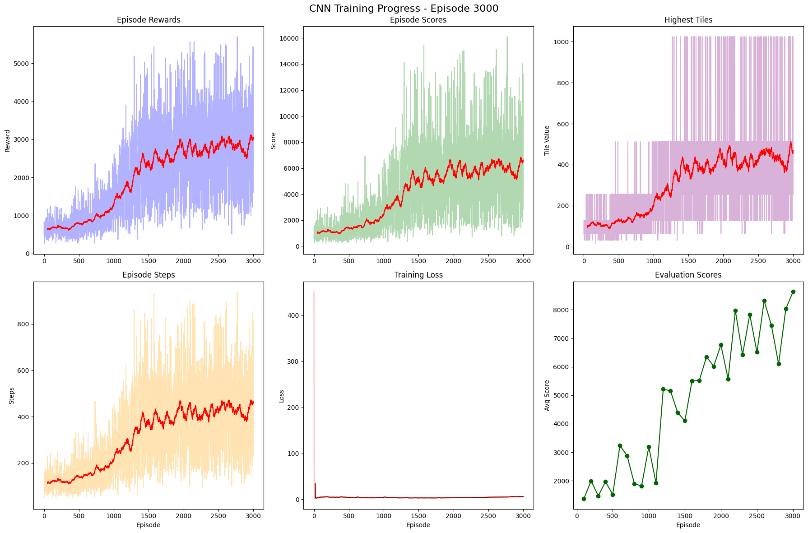
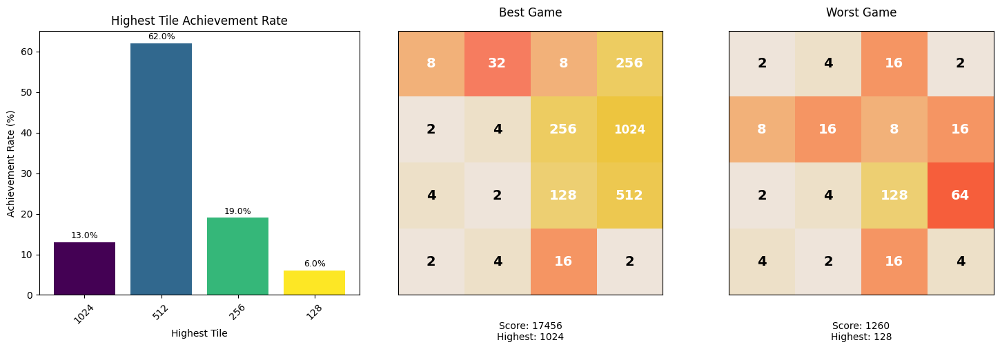

<p align="center">
  <a href="https://2048-rl-project.vercel.app/">🔗 Visualization</a>
</p>

# Solve 2048 by DQN

## Archive

### [PPT](./docs/PPT_2048_DQN.pdf)
### [Report](./docs/Report_2048_DQN.docx.pdf)
### [Project](https://recondite-lungfish-fd3.notion.site/1b084d3f783080978dddd658aa65fdc4?source=copy_link)
### [Dev Log - @Sarang Han](https://sarangswork.notion.site/2048-Agent-22d7b43d5de780beb508fb92ade9583f?source=copy_link)

## Abstract

본 연구는 강화학습 기반의 **심층 Q-네트워크**(Deep Q-Network, DQN)를 활용하여 2048 게임을 효과적으로 학습하는 모델을 구축한다. 기본 DQN에 Double/Dueling DQN, Prioritized Experience Replay(PER) 등의 개선 기법을 적용하고, ε-탐욕 정책과 보상 함수 설계가 학습 성능에 미치는 영향을 분석하였다.

실험 결과, 개선 기법을 적용한 모델이 기본 DQN 대비 더 빠른 수렴과 높은 평균 보상을 기록했으며, 적절한 파라미터 설정과 병합 점수·빈 칸 수를 반영한 보상 설계가 안정적인 학습에 효과적임을 확인하였다. 본 연구는 2048과 같은 퍼즐 게임에서 강화학습 기법의 적용 가능성을 보여주며, DQN 성능 개선 요인에 대한 체계적인 검증 결과를 제공한다.

This research builds an effective model for learning the 2048 game using reinforcement learning-based **Deep Q-Network (DQN)**. We applied improvement techniques such as Double/Dueling DQN and Prioritized Experience Replay (PER) to the basic DQN architecture, and analyzed the impact of ε-greedy policy and reward function design on learning performance.

Experimental results showed that models with improvement techniques achieved faster convergence and higher average rewards compared to basic DQN. Appropriate parameter settings and reward design incorporating merge scores and empty tile counts proved effective for stable learning. This research demonstrates the applicability of reinforcement learning techniques in puzzle games like 2048 and provides systematic validation of DQN performance improvement factors.

## Structure
```
25-2-2048/
├── docs/
├── public/
├── models/                         
├── src/                      # Agent 시각화, 게임 로직 관련 코드
│   ├── app/
│   ├── components/
│   ├── lib/
│   └── types/
├── training/                 # model training 관련 코드
│   ├── __init__.py
│   ├── environment/          # 2048 gym 환경
│   ├── models/               # 2048 DQN agent
│   │   ├── __init__.py
│   │   ├── dqn_agent.py
│   │   ├── networks.py
│   │   └── replay_buffer.py
│   └── train/                # 모델 학습 주피터 노트북
│       ├── __init__.py
│       └── colab_training.ipynb
```
## How to run

### 웹 애플리케이션 실행
```bash
npm install
npm run dev
```

### DQN 에이전트 학습

1. 구글 드라이브에 `2048-rl-project/` 폴더를 생성합니다.
2. 해당 폴더에 본 프로젝트의 `training/` 폴더 전체를 복사합니다.
3. `training/train/colab_training.ipynb` 노트북을 구글 Colab에서 실행하면 바로 학습이 가능합니다.
    - 필요한 경로 설정 및 환경설정은 노트북 내 안내에 따라 진행하세요.
    - Colab에서 GPU 런타임을 사용하면 더 빠른 학습이 가능합니다.

## TODO

- [x] 2048 환경, 환경 테스트 추가
- [x] 간단한 DQN 알고리즘 코드, 통합 테스트 추가
- [x] `__init__` 추가
- [x] 2048 1차 GUI 추가 
- [x] 2048 GUI 디자인 개선 - [참고](https://github.com/gabrielecirulli/2048)
- [x] Illegal move 예외처리 관련
- [x] DQN 알고리즘 개선
- [x] 액션 마스킹 적용

## Result 

### Training



```
  episodes: 3000
  max_score: 16108
  max_highest_tile: 1024
```

### Performance (100 Game Play)



```
  Average Score: 7403.1 ± 3361.9
  Best Score: 17456 (Highest Tile: 1024)
  Worst Score: 1260 (Highest Tile: 128)
  Average Highest Tile: 506.9
```


## About US

<table>
  <tr>
    <td align="center">
      <br>
      <b>Sarang Han</b><br>
      <a href="https://github.com/Sarang-Han">
        
      </a>
    </td>
    <td align="center">
      <br>
      <b>Yewon Jang</b><br>
      <a href="https://github.com/grace0039">
        
      </a>
    </td>
    <td align="center">
      <br>
      <b>SangA Choi</b><br>
      <a href="https://github.com/jj8ng">
        
      </a>
    </td>
  </tr>
</table>
